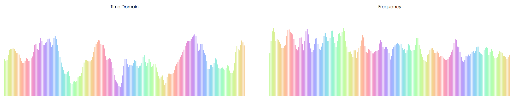
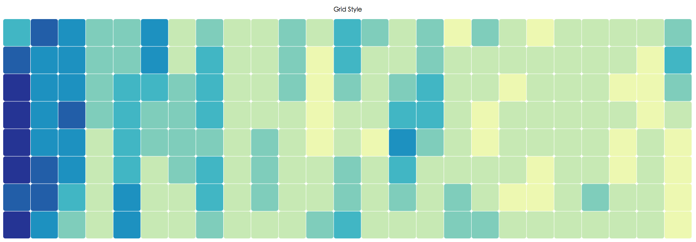

# 音乐节奏可视化

---

### 使用说明

该可视化程序可在线执行，访问地址是：[Music Visualization by Soros Liu](https://sorosliu1029.github.io/Computer_Graphics/) 

通过“选择文件”按钮选择音频文件（个人测试使用的是mp3格式的文件），点击播放条的“播放”按钮即可看到效果。

### 程序说明：

- 音乐输入：

  音乐输入采用HTML5的audio元素连接本地音频文件。

  采用mozilla提出的[Web Audio API](https://developer.mozilla.org/en-US/docs/Web/API/Web_Audio_API) 进行音频数据的提取。

  通过API的[音频分析节点(Analyser Node)](https://developer.mozilla.org/en-US/docs/Web/API/AnalyserNode)，获取音频数据，具体采用了两类数据：

  - [音频的时域数据](https://developer.mozilla.org/en-US/docs/Web/API/AnalyserNode/getByteTimeDomainData)：即为音频当前时间点的波形图，返回值为数组，每个数据点范围0-255
  - [音频的频率数据](https://developer.mozilla.org/en-US/docs/Web/API/AnalyserNode/getByteFrequencyData)：即为音频当前时间点的频率数据，返回值为数组，每个数据点范围0-255

- 可视化输出：

  可视化采用了d3.js这个JavaScript可视化库。

  可视化的绘图接收数组作为输入，数组的每个数据点决定绘图元素的高低或者颜色。

  - 条形图的高低是由音频的音量或者频率大小决定的

     

  - 网格图的颜色深浅是由音频的频率大小决定的

     

### 参考：

- [Web Audio API](https://developer.mozilla.org/en-US/docs/Web/API/Web_Audio_API)
- [Audio Analyser Node](https://developer.mozilla.org/en-US/docs/Web/API/AnalyserNode)
- [Audio Get Time Domain Data](https://developer.mozilla.org/en-US/docs/Web/API/AnalyserNode/getByteTimeDomainData)
- [Audio Get Frequency Data](https://developer.mozilla.org/en-US/docs/Web/API/AnalyserNode/getByteFrequencyData)
- [d3.js](https://d3js.org/)
- [d3 Grid Style](http://bl.ocks.org/tjdecke/5558084)