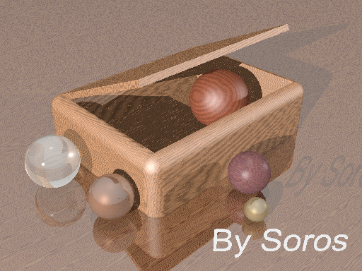

# 真实感静态景物

---

### 渲染结果：

 

#### 软件说明：

渲染软件采用的是[POV-Ray](http://www.povray.org/)。

官网提供了Windows下的安装文件，以及相应的编辑器。

[POV-Ray Docs](http://www.povray.org/documentation/3.7.0/)是软件的使用文档。

[POV-Ray SDL](http://www.povray.org/documentation/view/3.6.0/224/) (Scene Description Language — 景物描述语言)是这款软件使用的程序语言。

#### 程序说明：

1. 定义camera, 定位相机位置和角度（也即渲染结果的视角）
2. 定义几处光源，用来制造明暗和阴影效果，使得结果更逼真（从左边的玻璃球可以看出有三个光源）
3. 定义多条颜色带，用来给地板和盒子做材质的渲染
4. 定义一块无限延展的平面作为地板，使用步骤3定义的材质进行渲染
5. 定义“盒形”（Box），“柱形”（Cylinder）这些基本元素，作为盒子的面板和圆滑拐角
6. 将步骤5中的元素**相并**，定义出一个盒子
7. 定义“球形”(Sphere)基本元素，作为场景中的几个球体
8. 这些球体的渲染材质有金属，木纹和玻璃
9. 添加一处立体字作为水印
10. 最终的渲染是地板，盒子，球体，文字的组合

参考：

[POV-Ray Reference](http://www.povray.org/documentation/3.7.0/r3_0.html)

[POV-Ray 作品集](http://www.povray.org/resources/)

